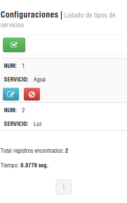
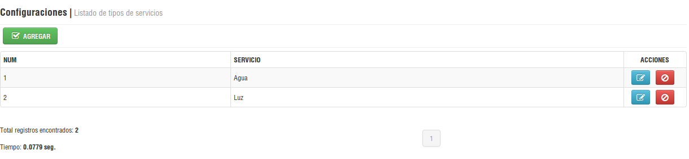
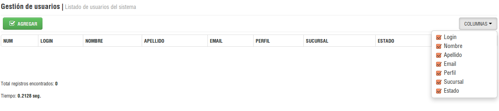
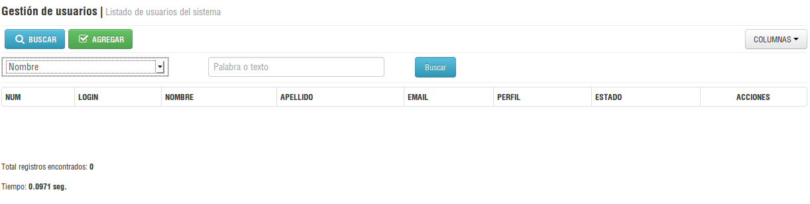
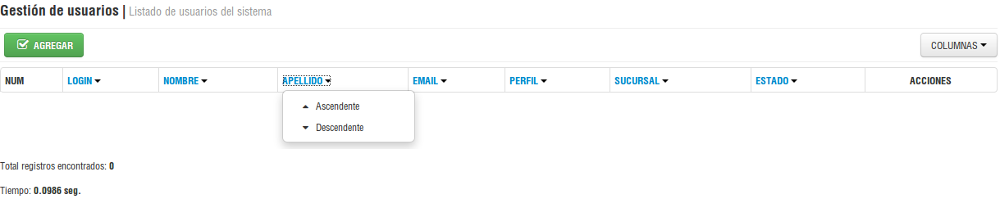
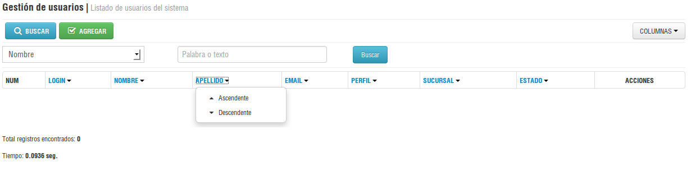

Datagrid
====================
.. contents:: El ``dbkm`` posee un plugin de jQuery adaptado para kumbiaphp y de uso básico para datagrid responsivos o adaptables a cualquier tipo de pantalla.

Modo básico
--------------------
Podemos especificar un modo básico de datagrid responsivo.  Para este caso armamos la siguiente vista:

.. code-block:: php

    <?php View::notify(); ?>

    

    

        <?php View::process($page_module, $page_title, $set_title); ?>

        <!-- Contenedor para los botones superiores -->
        

            

                <?php echo DwHtml::button("config/servicio/agregar/", 'agregar', array('class'=>'btn-success'), 'check', APP_AJAX); ?>
            

        

        

            <!-- Se debe indicar la clase "tabla-responsive" -->
            <table class="table table-bordered table-hover table-striped table-condensed table-responsive">
                <thead>
                    <tr>
                        <th>NUM</th>
                        <th>SERVICIO</th>
                        <th class="btn-actions no-responsive" style="width: 100px;">ACCIONES</th>
                    </tr>
                </thead>
            </table>
        

    

Con lo anterior tendremos la siguiente vista:

   Vista móvil

   Vista desktop

Ocultando columnas
--------------------
Para ocultar las columnas tan solo se indica en las cabeceras la clase ``col-collapsed`` de las mismas.  Para este caso armamos la siguiente vista:

.. code-block:: php

    <?php View::notify(); ?>

    

    

        <?php View::process($page_module, $page_title, $set_title); ?>

        <!-- Contenedor para los botones superiores -->
        

            

                <?php echo DwHtml::button("sistema/usuario/agregar/", 'agregar', array('class'=>'btn-success'), 'check', APP_AJAX); ?>
            

        

        

            <!-- Se debe indicar la clase "tabla-responsive" -->
            <table class="table table-bordered table-hover table-striped table-condensed table-responsive">
                <thead>
                    <tr>
                        <th>NUM</th>
                        <th class="col-collapse">NOMBRE</th>
                        <th class="col-collapse">APELLIDO</th>
                        <th class="col-collapse">EMAIL</th>
                        <th class="col-collapse">PERFIL</th>
                        <th class="col-collapse">ESTADO</th>
                        <th class="no-responsive btn-actions" style="width: 150px;">ACCIONES</th>
                    </tr>
                </thead>
            </table>

        

    

Con lo anterior tendremos la siguiente vista:

   Vista desktop

Vista con formulario de búsqueda
--------------------
Podemos especificar un modo con formulario de búsqueda según las columnas definidas en la cabecera con el atributo ``data-search="campo"`` donde ``campo`` será la columna de búsqueda en la base de datos.  Para este caso armamos la siguiente vista:

.. code-block:: php

    <?php View::notify(); ?>

    

    

        <?php View::process($page_module, $page_title, $set_title); ?>

        <!-- Contenedor para los botones superiores -->
        

            

                <?php echo DwHtml::button("sistema/usuario/agregar/", 'agregar', array('class'=>'btn-success'), 'check', APP_AJAX); ?>
            

        

        

            <!-- Se debe indicar la clase "tabla-responsive" -->
            <table class="table table-bordered table-hover table-striped table-condensed table-responsive">
                <thead>
                    <tr>
                        <th>NUM</th>
                        <th class="col-collapse" data-search="login">LOGIN</th>
                        <th class="col-collapse" data-search="nombre">NOMBRE</th>
                        <th class="col-collapse" data-search="apellido">APELLIDO</th>
                        <th class="col-collapse" data-search="email">EMAIL</th>
                        <th class="col-collapse" data-search="perfil">PERFIL</th>
                        <th class="col-collapse" data-search="estado_usuario">ESTADO</th>
                        <th class="btn-actions no-responsive" style="width: 100px;">ACCIONES</th>
                    </tr>
                </thead>
            </table>

        

    

**Nota:** El form_action mandará a la siguiente url: /sistema/usuario/buscar/campo/valor/, donde ``campo`` es el valor del select y ``valor`` es el texto digitado de búsqueda

Con lo anterior tendremos la siguiente vista:

   Vista desktop

Vista con ordenamiento
--------------------
Podemos especificar un modo adicional y es el del ordenamiento según las columnas definidas en la cabecera con el atributo ``data-search="campo"`` donde ``campo`` será la columna de ordenamiento.  Para este caso armamos la siguiente vista:

.. code-block:: php

    <?php View::notify(); ?>

    

    

        <?php View::process($page_module, $page_title, $set_title); ?>

        <!-- Contenedor para los botones superiores -->
        

            

                <?php echo DwHtml::button("sistema/usuario/agregar/", 'agregar', array('class'=>'btn-success'), 'check', APP_AJAX); ?>
            

        

        

            <!-- Se debe indicar la clase "tabla-responsive" -->
            <table class="table table-bordered table-hover table-striped table-condensed table-responsive">
                <thead>
                    <tr>
                        <th>NUM</th>
                        <th class="col-collapse" data-search="login">LOGIN</th>
                        <th class="col-collapse" data-search="nombre">NOMBRE</th>
                        <th class="col-collapse" data-search="apellido">APELLIDO</th>
                        <th class="col-collapse" data-search="email">EMAIL</th>
                        <th class="col-collapse" data-search="perfil">PERFIL</th>
                        <th class="col-collapse" data-search="estado_usuario">ESTADO</th>
                        <th class="btn-actions no-responsive" style="width: 100px;">ACCIONES</th>
                    </tr>
                </thead>
            </table>

        

    

**Nota:** El order_action mandará a la siguiente url: /sistema/usuario/listar/order.campo.asc/, donde ``campo`` es el valor de la columna seleccionada

Con lo anterior tendremos la siguiente vista:

   Vista desktop

Vista con formulario y ordenamiento
--------------------
Podemos especificar un modo adicional y es el del ordenamiento según las columnas definidas en la cabecera con el atributo ``data-search="campo"`` donde ``campo`` será la columna de ordenamiento.  Para este caso armamos la siguiente vista:

.. code-block:: php

    <?php View::notify(); ?>

    

    

        <?php View::process($page_module, $page_title, $set_title); ?>

        <!-- Contenedor para los botones superiores -->
        

            

                <?php echo DwHtml::button("sistema/usuario/agregar/", 'agregar', array('class'=>'btn-success'), 'check', APP_AJAX); ?>
            

        

        

            <!-- Se debe indicar la clase "tabla-responsive" -->
            <table class="table table-bordered table-hover table-striped table-condensed table-responsive">
                <thead>
                    <tr>
                        <th>NUM</th>
                        <th class="col-collapse" data-search="login">LOGIN</th>
                        <th class="col-collapse" data-search="nombre">NOMBRE</th>
                        <th class="col-collapse" data-search="apellido">APELLIDO</th>
                        <th class="col-collapse" data-search="email">EMAIL</th>
                        <th class="col-collapse" data-search="perfil">PERFIL</th>
                        <th class="col-collapse" data-search="estado_usuario">ESTADO</th>
                        <th class="btn-actions no-responsive" style="width: 100px;">ACCIONES</th>
                    </tr>
                </thead>
            </table>

        

    

Con lo anterior tendremos la siguiente vista:

   Vista desktop
